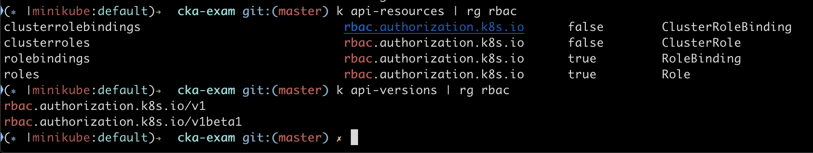

### API objects
- Resources related to RBAC are under the api group `rbac.authorization.k8s.io`


- Enable RBAC
    ```
    kube-apiserver --authorization-mode=Example,RBAC --other-options
    ```
- An RBAC Role or ClusterRole contains rules that represent a set of permissions. Permissions are purely additive (there are no "deny" rules)

**Role**
- namespaced resource
- sets permissions within a particular namespace
- Example: grant read access to all pods in default namespace
    ```yaml
    apiVersion: rbac.authorization.k8s.io/v1
    kind: Role
    metadata:
        namespace: default
        name: pod-reader
    rules:
    - apiGroups: [""] # "" indicates the core API group
      resources: ["pods"] # use `kubectl api-resources` to get all resources
      verbs: ["get", "watch", "list"]
    ```

**ClusterRole**
- non-namespaced resource(cluster scoped)
- define permissions on namespaced resources and be granted within individual namespace(s)
- define permissions on namespaced resources and be granted across all namespaces
- define permissions on cluster-scoped resources like nodes and non-resource endpoints (like /healthz)
- Example: grant read access to secrets in any particular namespace, or across all namespaces (depending on how it is bound)
    ```yaml
    apiVersion: rbac.authorization.k8s.io/v1
    kind: ClusterRole
    metadata:
        # "namespace" omitted since ClusterRoles are not namespaced
        name: secret-reader
    rules:
    - apiGroups: [""]
      # at the HTTP level, the name of the resource for accessing Secret
      # objects is "secrets"
      resources: ["secrets"]
      verbs: ["get", "watch", "list"]
    ```

**RoleBinding**
- grants the permissions defined in a role to a user or set of users(groups) or service-accounts
- may reference any Role in the same namespace
- can also reference a ClusterRole to grant the permissions defined in that ClusterRole to resources inside the RoleBinding's namespace
- After you create a binding, you cannot change the Role or ClusterRole that it refers to (roleRef). 
- To change the roleRef for a binding, delete the binding object and create a replacement or use reconcile command.
  ```yaml
  ## Reconcile rbac resources from a file
  kubectl auth reconcile -f my-rbac-rules.yaml
  ```
- Example:
  ```yaml
  apiVersion: rbac.authorization.k8s.io/v1
  # This role binding allows "jane" to read pods in the "default" namespace.
  # You need to already have a Role named "pod-reader" in that namespace.
  kind: RoleBinding
  metadata:
    name: read-pods
    namespace: default
  subjects:
  # You can specify more than one "subject"
  - kind: User
    name: jane # "name" is case sensitive
    apiGroup: rbac.authorization.k8s.io
  roleRef:
    # "roleRef" specifies the binding to a Role / ClusterRole
    kind: Role #this must be Role or ClusterRole
    name: pod-reader # must match the name of the Role/ClusterRole you wish to bind to
    apiGroup: rbac.authorization.k8s.io
  ```

**ClusterRoleBinding**
- Example: 
  ```yaml
  apiVersion: rbac.authorization.k8s.io/v1 
  # This ClusterRoleBinding allows anyone in the "manager" group to read secrets in any namespace
  kind: ClusterRoleBinding
  metadata:
    name: read-secrets-global
  subjects:
  - kind: Group
    name: manager
    apiGroup: rbac.authorization.k8s.io
  roleRef:
    kind: ClusterRole
    name: secret-reader
    apiGroup: rbac.authorization.k8s.io
  ```

**Refering to resources**
- subresources: `Example: access logs of pods`
  ```yaml
  rules:
  - apiGroups: [""]
    resources: ["pods", "pods/log"]
    verbs: ["get", "list"]
  ```
- specific resources by name
  ```yaml
  rules:
  - apiGroups: [""]
    # at HTTP level, name of the resource for accessing ConfigMap objects is "configmaps"
    resources: ["configmaps"]
    resourceNames: ["my-configmap"]
    verbs: ["update", "get"]
  ```
> Note: You cannot restrict create or deletecollection requests by resourceName. For create, this limitation is because the object name is not known at authorization time.

**Aggregated ClusterRoles**
- can aggregate several ClusterRoles into one combined ClusterRole
- controller in control plane watches for ClusterRoles with aggregationRule and updates rules in that
```yaml
apiVersion: rbac.authorization.k8s.io/v1
kind: ClusterRole
metadata:
  name: monitoring
aggregationRule:
  clusterRoleSelectors:
  - matchLabels:
      rbac.example.com/aggregate-to-monitoring: "true"
rules: [] # The controller in control plane automatically fills in the rules
```

**Some examples**
```yaml
# deployments in both extensions and apps apigroup
rules:
- apiGroups: ["extensions", "apps"]
  resources: ["deployments"] 
  verbs: ["get"]
```

```yaml
# Allow GET and POST requests to the non-resource endpoints
rules:
- nonResourceURLs: ["/healthz", "/healthz/*"] # '*' in a nonResourceURL is a suffix glob match
  verbs: ["get", "post"]
```

**Referring to subjects**
```yaml
subjects:
- kind: Group # Other values are User and ServiceAccount
  name: system:authenticated # starting with `system:` is cluster reserved groups 
  apiGroup: rbac.authorization.k8s.io # use namespace in case of ServiceAccount
```

### Default roles and rolebindings
- API servers create a set of default ClusterRole and ClusterRoleBinding objects
- Many of these are system: prefixed, which indicates that the resource is directly managed by the cluster control plane
- labeled with `kubernetes.io/bootstrapping=rbac-defaults`
- apiserver does auto-reconcilation at each startup
    - enabled by default if the RBAC authorizer is active
    - to opt out, set `rbac.authorization.kubernetes.io/autoupdate=false` on default cluster roles and bindings
```yaml
# All default clusterroles
k get clusterroles | grep 'system:'
```

**API discovery roles**
- Default clusterrolebinding `system:public-info-viewer` assigns default clusterrole `system:public-info-viewer` to `system:unauthenticated` group. This allows read-only access to non-sensitive information about the cluster 
- To stop exposing version info to anonymous users, remove `/version` from clusterrole `system:public-info-viewer` and set `rbac.authorization.kubernetes.io/autoupdate: "false"`
- More default clusterroles for API discovery: https://kubernetes.io/docs/reference/access-authn-authz/rbac/#discovery-roles

**User facing roles**
- Some default clusterroles are not `system:` prefixed as they are user-facing roles.
    - cluster-admin
    - admin
    - edit
    - view
- More info: https://kubernetes.io/docs/reference/access-authn-authz/rbac/#user-facing-roles

**Core component roles**
- Default clusterroles for core components
    - system:kube-scheduler
    - system:volume-scheduler
    - system:kube-controller-manager
    - system:node 
        - You should use the Node authorizer and NodeRestriction admission plugin instead of the system:node role
    - system:node-proxier
- More info: https://kubernetes.io/docs/reference/access-authn-authz/rbac/#core-component-roles

**Other Component Roles**
- https://kubernetes.io/docs/reference/access-authn-authz/rbac/#other-component-roles

**Roles for built-in controllers**
- K8s controller manager runs controllers that are built in to the K8s control plane
- When invoked with `--use-service-account-credentials`, kube-controller-manager starts each controller using a separate service account.
- Corresponding roles exist for each built-in controller, prefixed with system:controller:
- More info: https://kubernetes.io/docs/reference/access-authn-authz/rbac/#controller-roles

**Privilege escalation prevention**
- role creation/update
    - should have all the permissions contained in the role, at the same scope as the object being modified. `cluster-wide for a ClusterRole, within the same namespace or cluster-wide for a Role` (or)
    - granted explicit permission to perform the `escalate` verb on the roles or clusterroles resource

- rolebinding creation/update
    - should have permissions contained in the role (or)
    - should have permission to perform the `bind` verb on the particular Role/ClusterRole
- Example: allow `user-1` to grant other users the `admin`, `edit`, and `view` roles in the namespace `user-1-namespace`
  ```yaml
  apiVersion: rbac.authorization.k8s.io/v1
  kind: ClusterRole
  metadata:
    name: role-grantor
  rules:
  - apiGroups: ["rbac.authorization.k8s.io"]
    resources: ["rolebindings"]
    verbs: ["create"]
  - apiGroups: ["rbac.authorization.k8s.io"]
    resources: ["clusterroles"]
    verbs: ["bind"]
    resourceNames: ["admin","edit","view"]
  ---
  apiVersion: rbac.authorization.k8s.io/v1
  kind: RoleBinding
  metadata:
    name: role-grantor-binding
    namespace: user-1-namespace
  roleRef:
    apiGroup: rbac.authorization.k8s.io
    kind: ClusterRole
    name: role-grantor
  subjects:
  - apiGroup: rbac.authorization.k8s.io
    kind: User
    name: user-1
  ```

**Bootstrapping**
- To bootstrap initial roles and role bindings, use `cluster-admin` super-user role

### Command Line Utilities
**kubectl create role**
```shell
# Role "pod-reader" allows users to perform get, watch and list on pods
kubectl create role pod-reader \
  --verb=get --verb=list --verb=watch \
  --resource=pods

# With resourceNames specified  
kubectl create role pod-reader \
  --verb=get \
  --resource=pods \
  --resource-name=readablepod --resource-name=anotherpod

# With apiGroups specified
kubectl create role foo \
  --verb=get,list,watch \
  --resource=replicasets.apps

# With subresource permissions
kubectl create role foo \
  --verb=get,list,watch \
  --resource=pods,pods/status

# With permissions to get/update a resource with a specific name
kubectl create role my-component-lease-holder \
  --verb=get,list,watch,update \
  --resource=lease \
  --resource-name=my-component
```
**kubectl create clusterrole**
```yaml
# With nonResourceURL specified
kubectl create clusterrole foo \
  --verb=get \
  --non-resource-url=/logs/*

# With an aggregationRule specified
kubectl create clusterrole monitoring \
  --aggregation-rule="rbac.example.com/aggregate-to-monitoring=true"
```
**kubectl create rolebinding**
```shell
# Within the namespace "acme", 
# grant permissions in "admin" ClusterRole to a user named "bob"
kubectl create rolebinding bob-admin-binding \
  --clusterrole=admin --user=bob --namespace=acme

# Within the namespace "acme", 
# grant permissions in "view" ClusterRole
# to the serviceaccount "myapp" in the namespace "acme" named "myapp
kubectl create rolebinding myapp-view-binding \
  --clusterrole=view --serviceaccount=acme:myapp --namespace=acme

# Within the namespace "acme", 
# grant permissions in "view" ClusterRole
# to the serviceaccount "myapp" in the namespace "myappnamespace" 
kubectl create rolebinding myappnamespace-myapp-view-binding \
  --clusterrole=view --serviceaccount=myappnamespace:myapp --namespace=acme
```
**kubectl create clusterrolebinding**
```shell
# Across the entire cluster,
# grant permissions in "cluster-admin" ClusterRole to a user "root"
kubectl create clusterrolebinding root-cluster-admin-binding \
  --clusterrole=cluster-admin --user=root

# Across the entire cluster,
# grant permissions in "view" ClusterRole
# to a serviceaccount "myapp" in the namespace "acme"
kubectl create clusterrolebinding myapp-view-binding \
  --clusterrole=view --serviceaccount=acme:myapp
```
**kubectl auth reconcile**
- Creates or updates `rbac.authorization.k8s.io/v1` API objects from a manifest file
- remove extra permissions if `--remove-extra-permissions` is specified
- remove extra subjects if `--remove-extra-subjects` is specified
- Example: 
  ```shell
  # Test applying a manifest file of RBAC objects, displaying changes to be made
  kubectl auth reconcile -f my-rbac-rules.yaml --dry-run=client
  ```
- More info: https://kubernetes.io/docs/reference/access-authn-authz/rbac/#command-line-utilities

### Serviceaccount permissions
- Default RBAC policies grant scoped permissions to control-plane components, nodes, and controllers, but grant `no permissions` to service accounts outside the `kube-system` namespace (beyond discovery permissions given to all authenticated users)
- Fine-grained role bindings provide greater security, but require more effort to administrate
- Broader grants can give unnecessary (and potentially escalating) API access to ServiceAccounts, but are easier to administrate
- Approaches(most secure to least secure)
  - Grant a role to an application-specific service account (best practice)
  ```shell
  # grant read-only permission within "my-namespace" to the "my-sa" service account
  kubectl create rolebinding my-sa-view \
    --clusterrole=view \
    --serviceaccount=my-namespace:my-sa \
    --namespace=my-namespace
  ```
  - Grant a role to the "default" service account in a namespace
  ```shell
  # grant read-only permission within "my-namespace" to the "default" service account
  kubectl create rolebinding default-view \
    --clusterrole=view \
    --serviceaccount=my-namespace:default \
    --namespace=my-namespace

  # grant cluster-admin permissions to the "default" service account in kube-system namespace
  kubectl create clusterrolebinding add-on-cluster-admin \
    --clusterrole=cluster-admin \
    --serviceaccount=kube-system:default
  ```
  - Grant a role to all service accounts in a namespace
  ```shell
  # grant read-only permission within "my-namespace" 
  # to all service accounts in that namespace
  kubectl create rolebinding serviceaccounts-view \
    --clusterrole=view \
    --group=system:serviceaccounts:my-namespace \
    --namespace=my-namespace
  ```
  - Grant a limited role to all service accounts cluster-wide (discouraged)
  ```shell
  # grant read-only permission across all namespaces 
  # to all service accounts in the cluster
  kubectl create clusterrolebinding serviceaccounts-view \
    --clusterrole=view \
    --group=system:serviceaccounts
  ```
  - Grant super-user access to all service accounts cluster-wide (strongly discouraged)
  ```shell
  kubectl create clusterrolebinding serviceaccounts-cluster-admin \
    --clusterrole=cluster-admin \
    --group=system:serviceaccounts
  ```

### Upgrading from ABAC
- `--authorization-mode=...,RBAC,ABAC`. This means that any request allowed by either the RBAC or ABAC policies is allowed
- if earlier authorizers, such as Node, deny a request, then the the RBAC authorizer attempts to authorize the API request. If RBAC also denies that API request, the ABAC authorizer is then run.

### Request Verbs in Roles/ClusterRoles
- Non-resource requests: 
  - get, post, put, delete
- Resource requests: 
  - create, get, list, watch, update, patch, delete, deletecollection
- PodSecurityPolicy: 
  - `use` verb on `podsecuritypolicies` resources in the `policy` API group
- RBAC: 
  - `bind` and `escalate` verbs on `roles` and `clusterroles` resources in the `rbac.authorization.k8s.io` API group
- Authentication:
  - `impersonate` verb on `users`, `groups`, and `serviceaccounts` in the core API group, and the `userextras` in the `authentication.k8s.io` API group

### Authorization Modes
- Node
- ABAC - Attribute-based access control
- RBAC - Role-based access control
- Webhook - HTTP callback
- AlwaysDeny
- AlwaysAllow
- apiserver flag: `--authorization-mode=Node,...`
- More Info: https://kubernetes.io/docs/reference/access-authn-authz/authorization/#authorization-modules

### Multiple Authorization Modules
- When multiple authorization modules are configured, each is checked in sequence. 
- If any authorizer approves or denies a request, that decision is immediately returned and no other authorizer is consulted. 
- If all modules have no opinion on the request, then the request is denied. A deny returns an HTTP status code 403

### Checking API Access

- `kubectl auth can-i` command uses `SelfSubjectAccessReview` of `authorization.k8s.io` API group
```shell
kubectl auth can-i create deployments --namespace dev

# Administrators can combine this with user impersonation 
# to determine what action other users can perform
kubectl auth can-i list secrets --namespace dev --as dave

kubectl auth can-i get secret --as secret@test.com

# for service accounts, we have use system:serviceaccount:<namespace>:<serviceaccount-name>
kubectl auth can-i get pods --as system:serviceaccount:default:sa-name
```

### Node Authorization
- In order to be authorized by the Node authorizer, kubelets must use a credential that identifies them as being in the `system:nodes` group, with a username of `system:node:<nodeName>`
- The value of `<nodeName>` must match precisely the name of the node as registered by the kubelet. By default, this is the host name as provided by hostname, or overridden via the kubelet option `--hostname-override`
- To enable the Node authorizer, start the apiserver with `--authorization-mode=Node`
- To limit the API objects kubelets are able to write, enable the NodeRestriction admission plugin by starting the apiserver with `--enable-admission-plugins=...,NodeRestriction,...`
- Node authorizer allows kubelet to do these API operations: https://kubernetes.io/docs/reference/access-authn-authz/node/#overview


#### References:
https://kubernetes.io/docs/reference/access-authn-authz/rbac/
https://kubernetes.io/docs/reference/access-authn-authz/authorization
https://kubernetes.io/docs/reference/access-authn-authz/node/