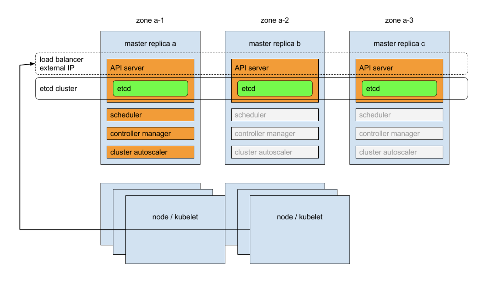

# HA K8s cluster

### External etcd cluster approach
- more infrastructure
- control plane nodes and etcd members are separated

### Stacked control plane approach
- less infrastructure
- etcd members and control plane nodes are co-located

Each of master replicas will run the following components in the following mode:
- etcd instance: all instances will be clustered together using consensus;
    - A local etcd member is created automatically on control plane nodes when using `kubeadm init` and `kubeadm join --control-plane`
- API server: each server will talk to local etcd - all API servers in the cluster will be available;
- controllers, scheduler, and cluster auto-scaler: will use lease mechanism - only one instance of each of them will be active in the cluster;
- add-on manager: each manager will work independently trying to keep add-ons in sync.

In addition, there will be a load balancer in front of API servers that will route external and internal traffic to them.

- minimum of three stacked control plane nodes for an HA cluster, to tolerate one node going down (because of etcd cluster)

## Installation
https://kubernetes.io/docs/setup/production-environment/tools/kubeadm/high-availability/

### References:
- https://kubernetes.io/docs/tasks/administer-cluster/highly-available-master/
- https://kubernetes.io/docs/setup/production-environment/tools/kubeadm/high-availability/
- https://kubernetes.io/docs/setup/production-environment/tools/kubeadm/ha-topology/