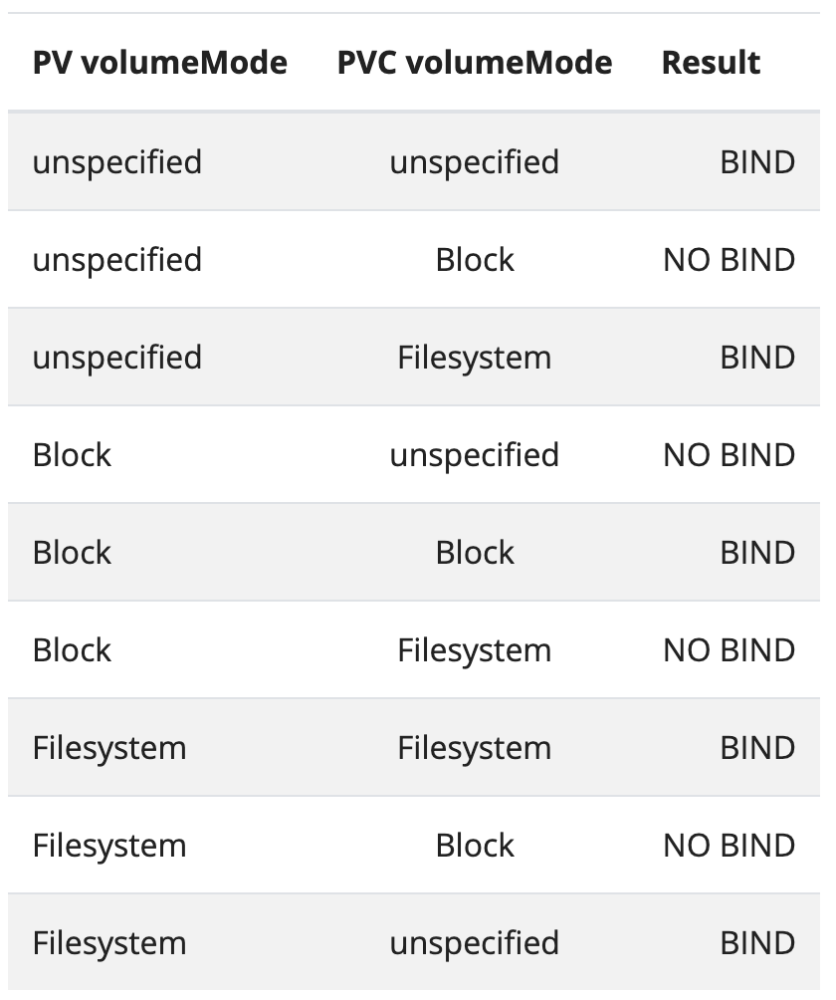

# Persistent Volumes

- `PersistentVolume (PV)` is a piece of storage in the cluster that has been provisioned by an administrator or dynamically provisioned using Storage Classes
    - PVs are volume plugins like Volumes, but have a lifecycle independent of any individual Pod that uses the PV
- `PersistentVolumeClaim (PVC)` is a request for storage by a user
    - can request specific size and access modes
- PVs are resources in the cluster. PVCs are requests for those resources and also act as claim checks to the resource

### Lifecyle of a volume and claim

**Provisioning**
- `static`
    - A cluster administrator creates a number of PVs. They carry the details of the real storage, which is available for use by cluster users.
- `dynamic`: 
    - When none of the static PVs the administrator created match a user's PersistentVolumeClaim, the cluster may try to dynamically provision a volume specially for the PVC
    - it is based on StorageClasses: the PVC must request a storage class and the administrator must have created and configured that class for dynamic provisioning to occur
    - Claims that request the class "" effectively disable dynamic provisioning for themselves
    - To enable dynamic storage provisioning based on storage class, enable the `DefaultStorageClass` admission controller on the API server(--enable-admission-plugins)

**Binding**
- A PVC to PV binding is a one-to-one mapping, using a ClaimRef which is a bi-directional binding between the PersistentVolume and the PersistentVolumeClaim
- Claims will remain unbound indefinitely if a matching volume does not exist

**Using**
- Pods use claims as volumes
- The cluster inspects the claim to find the bound volume and mounts that volume for a Pod
- For volumes that support multiple access modes, the user specifies which mode is desired when using their claim as a volume in a Pod
- Users schedule Pods and access their claimed PVs by including a `persistentVolumeClaim` section in a Pod's `volumes` block

**Storage Object in Use Protection**
- PVC is in active use by a Pod when a Pod object exists that is using the PVC
- If a user deletes a PVC in active use by a Pod, the PVC is not removed immediately. PVC removal is postponed until the PVC is no longer actively used by any Pods. 
- Also, if an admin deletes a PV that is bound to a PVC, the PV is not removed immediately. PV removal is postponed until the PV is no longer bound to a PVC
- You can see that a PVC is protected when the PVC's status is `Terminating` and the `Finalizers` list includes `kubernetes.io/pvc-protection`
- You can see that a PV is protected when the PV's status is `Terminating` and the `Finalizers` list includes `kubernetes.io/pv-protection`

**Reclaiming**
- reclaim policy for a PersistentVolume tells the cluster what to do with the volume after it has been released of its claim
- `Retain`:
    - allows for manual reclamation of the resource
    - When the PVC is deleted, the PV still exists and the volume is considered "released". But it is not yet available for another claim because the previous claimant's data remains on the volume.
- `Delete`:
    - removes both the PV object from K8s, as well as the associated storage asset in the external infrastructure
    - Volumes that were dynamically provisioned inherit the reclaim policy of their StorageClass, which defaults to Delete
    -  PV can be edited or patched after it is created to change the reclaim policy
- `Recycle`: Deprecated
    - performs a basic scrub (rm -rf /thevolume/*) on the volume and makes it available again for a new claim

**Expanding Persistent Volumes Claims**
- beta feature, enabled by default
- can only expand a PVC if its storage class's `allowVolumeExpansion` field is set to true
- To request a larger volume for a PVC, edit the PVC object and specify a larger size. This triggers expansion of the volume that backs the underlying PersistentVolume. 
- A new PersistentVolume is never created to satisfy the claim. Instead, an existing volume is resized
- Resizing a volume containing a file system:
    - can only resize volumes of file systems: XFS, Ext3, or Ext4
    - the file system is only resized when a new Pod is using the PersistentVolumeClaim in ReadWrite mode
    - File system expansion is either done when a Pod is starting up or when a Pod is running and the underlying file system supports online expansion
- `ExpandInUsePersistentVolumes`- beta feature
    - no need to delete and recreate a Pod or deployment that is using existing PVC
    -  Any in-use PVC automatically becomes available to its Pod as soon as its file system has been expanded
    -  no effect on PVCs that are not in use by a Pod or deployment
    - You must create a Pod that uses the PVC before the expansion can complete

`types of volumes that support expansion`:
- gcePersistentDisk
- awsElasticBlockStore
- Cinder
- glusterfs
- rbd
- Azure File
- Azure Disk
- Portworx
- FlexVolumes
- CSI

**Recover from failure when expanding volumes**
- Mark PV bound to PVC with `Retain` claim policy
- Delete PVC. Since PV has Retain reclaim policy - we will not lose any data when we recreate the PVC
- Delete the `claimRef` entry from PV specs, so as new PVC can bind to it. This should make the PV Available
- Re-create the PVC with smaller size than PV and set `volumeName` field of the PVC to the name of the PV. This should bind new PVC to existing PV
- Don't forget to restore the reclaim policy of the PV

> if this manual recovery is not done, the resize requests are continuously retried by the controller

### Types of PV
- PersistentVolume types are implemented as plugins. 
https://kubernetes.io/docs/concepts/storage/persistent-volumes/#types-of-persistent-volumes

### Persistent Volumes
- 
```yaml
apiVersion: v1
kind: PersistentVolume # each pv contains a spec and status
metadata:
  name: pv0003
spec:
  capacity: # Currently, storage size is the only resource that can be set or requested. Future attributes may include IOPS, throughput, etc.
    storage: 5Gi # a PV will have a specific storage capacity
  volumeMode: Filesystem # Filesystem(Default) and Block, beta feature
  accessModes: # mandatory
    - ReadWriteOnce
  persistentVolumeReclaimPolicy: Recycle
  storageClassName: slow
  mountOptions:
    - hard
    - nfsvers=4.1
  nfs:
    path: /tmp
    server: 172.17.0.2
```

**Access Modes**
- ReadWriteOnce -- the volume can be mounted as read-write by a single node
- ReadOnlyMany -- the volume can be mounted read-only by many nodes
- ReadWriteMany -- the volume can be mounted as read-write by many nodes

> A volume can only be mounted using one access mode at a time, even if it supports many. For example, a GCEPersistentDisk can be mounted as ReadWriteOnce by a single node or ReadOnlyMany by many nodes, but not at the same time 

**Class**
- A PV can have a class, which is specified by setting the `storageClassName` attribute to the name of a StorageClass
- A PV of a particular class can only be bound to PVCs requesting that class. 
- A PV with no storageClassName has no class and can only be bound to PVCs that request no particular class
- In the past, the annotation `volume.beta.kubernetes.io/storage-class` was used instead of the storageClassName attribute. 
- This annotation is still working; however, it will become fully deprecated in a future Kubernetes release.

**Reclaim Policy**
- Retain -- manual reclamation; (default for manually created PersistentVolumes)
- Recycle -- basic scrub (rm -rf /thevolume/*). Currently, only NFS and HostPath support this (deprecated)
- Delete -- associated storage asset such as AWS EBS, GCE PD is deleted. (default for dynamically provisioned PersistentVolumes)

**Node Affinity**
- For most volume types, you do not need to set this field. It is automatically populated for AWS EBS, GCE PD and Azure Disk volume block types. You need to explicitly set this for local volumes
- A PV can specify node affinity to define constraints that limit what nodes this volume can be accessed from. 
- Pods that use a PV will only be scheduled to nodes that are selected by the node affinity

**Phase**
- Available -- a free resource that is not yet bound to a claim
- Bound -- the volume is bound to a claim
- Released -- the claim has been deleted, but the resource is not yet reclaimed by the cluster
- Failed -- the volume has failed its automatic reclamation

### Persistent Volume Claims
```yaml
apiVersion: v1
kind: PersistentVolumeClaim # Each PVC contains a spec and status
metadata:
  name: myclaim
spec:
  accessModes: # same as PV
    - ReadWriteOnce
  volumeMode: Filesystem # same as PV
  resources: # same as `capacity` in PV
    requests:
      storage: 8Gi
  storageClassName: slow
  selector: # label selector to filter the set of volumes; All of the requirements, from both matchLabels and matchExpressions, are ANDed together
    matchLabels:
      release: "stable"
    matchExpressions:
      - {key: environment, operator: In, values: [dev]}
```

**Class**
- `storageClassName`: not mandatory to mention
- empty value `""`: can only be bound to PVs with no class (no annotation or one set equal to "")
- no `storageClassName`: 
  - if `DefaultStorageClass` admission plugin enabled
    - can be bound only to PVs of that default
    - set annotation `storageclass.kubernetes.io/is-default-class` equal to true in a StorageClass object to make it default
    - in case of no default, it behaves as if admission plugin is disabled
  - else: can be bound only to PVs that have no class; same way as empty value.
- Currently, a PVC with a non-empty selector can't have a PV dynamically provisioned for it

### Claims As Volumes
- Claims must exist in the same namespace as the Pod using the claim
- cluster finds the claim in the Pod's namespace and uses it to get the PersistentVolume backing the claim. The volume is then mounted to the host and into the Pod
```
apiVersion: v1
kind: Pod
metadata:
  name: mypod
spec:
  containers:
    - name: myfrontend
      image: nginx
      volumeMounts:
      - mountPath: "/var/www/html"
        name: mypd
  volumes:
    - name: mypd
      persistentVolumeClaim:
        claimName: myclaim
```

### Raw Block Volume Support
https://kubernetes.io/docs/concepts/storage/persistent-volumes/#raw-block-volume-support

```yaml
spec: # for both PV and PVC
  volumeMode: Block
```
- When adding a raw block device for a Pod, you specify the device path in the container instead of a mount path
```yaml
spec:
  containers:
  - name: container
    volumeDevices:
      - name: data
        devicePath: /dev/xvda
  volumes:
    - name: data
      persistentVolumeClaim:
        claimName: block-pvc
```

**Volume binding matrix for statically provisioned volumes**



### Writing Portable Configuration
https://kubernetes.io/docs/concepts/storage/persistent-volumes/#writing-portable-configuration

### Static Provisioning - Example
- create pv
```yaml
# kubectl apply -f https://k8s.io/examples/pods/storage/pv-volume.yaml
apiVersion: v1
kind: PersistentVolume
metadata:
  name: task-pv-volume
  labels:
    type: local
spec:
  storageClassName: manual # no need to have storage class resource named `manual`
  capacity:
    storage: 10Gi
  accessModes:
    - ReadWriteOnce
  hostPath: 
    path: "/mnt/data" # volume is at `/mnt/data` on the cluster's Node
```

- create pvc
```yaml
apiVersion: v1
kind: PersistentVolumeClaim
metadata:
  name: task-pv-claim
spec:
  storageClassName: manual
  accessModes:
    - ReadWriteOnce
  resources:
    requests:
      storage: 3Gi
```
- create pod
```yaml
apiVersion: v1
kind: Pod
metadata:
  name: task-pv-pod
spec:
  volumes:
    - name: task-pv-storage
      persistentVolumeClaim:
        claimName: task-pv-claim
  containers:
    - name: task-pv-container
      image: nginx
      ports:
        - containerPort: 80
          name: "http-server"
      volumeMounts:
        - mountPath: "/usr/share/nginx/html"
          name: task-pv-storage
```
**Access control**
```yaml
apiVersion: v1
kind: PersistentVolume
metadata:
  name: pv1
  annotations:
    pv.beta.kubernetes.io/gid: "1234"
```
- Storage configured with a group ID (GID) allows writing only by Pods using the same GID. Mismatched or missing GIDs cause permission denied errors
- annotate a PersistentVolume with a GID; Then the GID is automatically added to any Pod that uses the PersistentVolume
- When a Pod consumes a PersistentVolume that has a GID annotation, the annotated GID is applied to all containers in the Pod in the same way that GIDs specified in the Pod's security context are


### Change Reclaim Policy

- Usecase:
  - default for dynamic provisioning: Delete
  - PV will be deleted once the PVC is deleted.
  - we might need to avoid such deletion in case of precious data. So use `retain` policy to manually recover data after PVC deletion

```sh
k patch pv <pv-name> -p '{"spec":{"persistentVolumeReclaimPolicy":"Retain"}}'
```

## References:
https://kubernetes.io/docs/concepts/storage/persistent-volumes/
https://kubernetes.io/docs/tasks/administer-cluster/change-pv-reclaim-policy/
